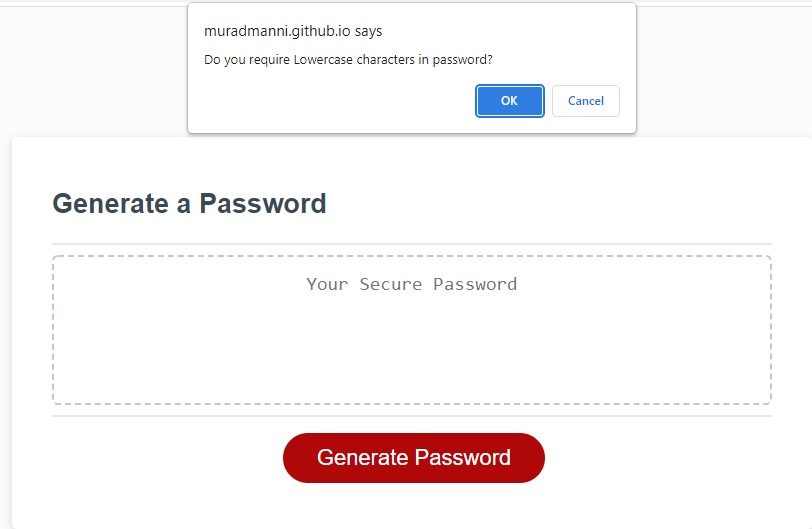

# homework-portfolio
Third assignment of Bootcamp

## Description

This is the THIRD assignment for the Bootcamp. GENERATING RANDOM PASSWORD was bit tricky in the beginning as I couldn't attend the Thursday class. But after watching the recored video (which was not fun), i was able to collect ideas and information how and what to get done.

It was nice to make the code and come up with ideas in order to use effective coding.

The layout of the index.html file was provided which made is quite easy to just write the javascript code.

I used the sample, provided in homework README and came up with my end result.

## Table of Contents

- [URL (deployed application)](#url)
- [URL (github repository)](#urlrepo)
- [Layout](#layout)
- [Credits](#credits)
- [License](#license)

## URL (deployed application)

Following is the url link to access the deployed application.

https://muradmanni.github.io/homework-generate-password/

## URL (github repository)

Following link is to access the code files using github repository.

https://github.com/muradmanni/homework-generate-password

## Layout
   

   
   
   

   

   

   

   

   

## Credits

I did alot of research using Google.com and found some free sample images to use. (www.freepik.com)

## License

No license required.